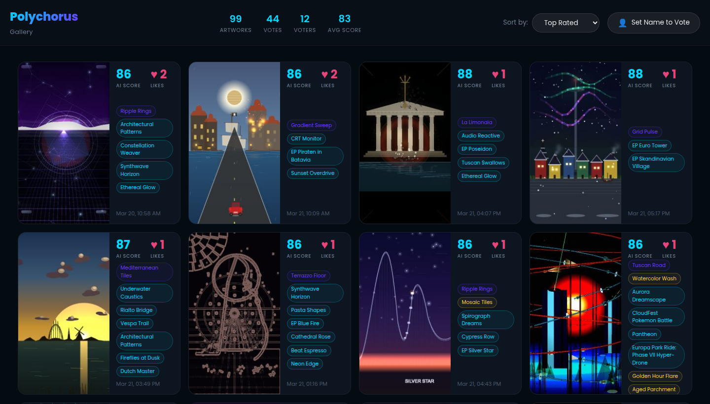
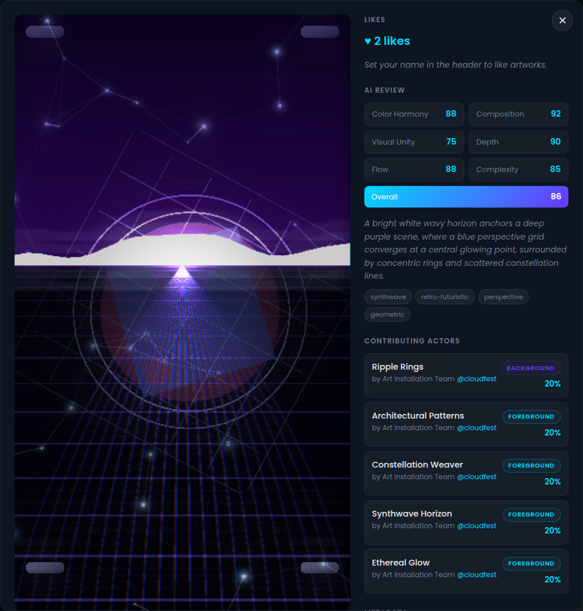

# Polychorus

**Generative chaos, accidental beauty.** Small programs paint together on a shared canvas. Every sixty seconds, a new ensemble takes over. No single actor controls the picture, and the result is something none of them could have made alone.

**[Explore Polychorus](https://polychorus.art/) · [Browse the gallery](https://polychorus.art/gallery) · [Watch the live canvas](https://live.polychorus.art/)**

[](https://polychorus.art/gallery)

*A selection from the CloudFest Hackathon collection: constellations, synthwave horizons, Italian landscapes, and Europa-Park rides sharing the same canvas.*

> **chorus** *noun* — (in ancient Greek tragedy) a group of performers who comment together on the main action.

## From hackathon side quest to shared artwork

Polychorus was built for the [CloudFest Hackathon 2026](https://hackathon.cloudfest.com/), held March 20–22 at Europa-Park in Rust, Germany. Organizer Carole Olinger asked whether the event could include something artistic. The answer was an installation that developers could contribute to: write a painting actor, open a pull request, and watch it join the canvas on the venue displays.

Over the weekend, **120 community actors** joined **52 built-in actors**, and the installation produced **4,770 artworks**. Contributions ranged from Tuscan scenery and theme-park rides to Wapuu, games, and visual glitches. Participants could write actors themselves or generate them from a natural-language description.

A Claude Code agent handled incoming pull requests and merge conflicts while GitHub Actions built and deployed the actors. The runtime hot-loaded new bundles without a restart, polling every thirty seconds. The cast kept growing while the installation kept painting.

## Where it stands today

The **live canvas still runs in your browser**, creating fresh combinations from the existing cast. The **gallery preserves the hackathon collection**, including AI reviews and contributor credits; new browser sessions do not add their paintings to that collection. The hackathon submission and automatic merge process is closed.

This repository contains the engine, gallery, actor tooling, and the full cast for local exploration. The actor creation instructions below are for experimenting on your own machine.

## How it works

1. **Pick an ensemble.** A scheduler selects one background actor, two to five foreground actors, and up to two filters for each layer, with a bias toward actors that have not appeared recently.
2. **Paint together.** Actors draw through a shared brush and filter API, layered by the Pixi.js renderer. Context providers expose time, weather, audio, webcam input, and social signals to actors that use them.
3. **Capture a composition.** In the hackathon installation, each sixty-second cycle ended with a snapshot submitted to the gallery.
4. **Review and rank.** Gemini 3.1 Pro via OpenRouter evaluated color harmony, composition, visual unity, depth and layering, rhythm and flow, and intentional complexity. Gallery ranking blended AI scores (60%) with visitor votes (40%); perceptual hashing and pruning kept near-duplicates and weaker results from crowding the selection.

[](https://polychorus.art/gallery/ed306288-4af9-4886-a316-9c751b656caf)

*Open a painting to see its review and the actors that made it. The scores record the AI critic's assessment; they are part of the experiment, not an objective measure of artistic quality.*

## Run it locally

Requirements: **Node.js 22+** and **pnpm 9+** (the repository pins pnpm 9.15.0).

```bash
git clone https://github.com/schlessera/art-installation.git
cd art-installation
pnpm install
pnpm dev              # Live canvas: http://localhost:3000
```

To run the gallery as well, open a second terminal:

```bash
pnpm dev:gallery      # API: http://localhost:3001; website: http://localhost:5173
```

These are the default ports; environment settings can override them. If you use [just](https://github.com/casey/just), `just dev` starts both services and loads the root `.env`. Run `just` to see the other recipes.

The canvas works without AI credentials. A local gallery uses mock reviews when `OPENROUTER_API_KEY` is unset. Set that variable in the server's environment for real reviews.

## Create a local actor

```bash
pnpm new:actor my-actor-name
pnpm install
# Edit actors/community/my-actor-name/src/index.ts
pnpm --filter @art/actor-my-actor-name validate
pnpm dev
# Open http://localhost:3000/?actor=my-actor-name
```

If the runtime is already running, restart it after adding an actor so Vite discovers the new files. Actors implement optional `setup()`, an `update()` called each frame, and optional `teardown()`, and declare a background, foreground, or filter role.

For AI-assisted actor creation:

```bash
pnpm generate:actor "slow gold spirals that react to music" --name gold-spirals
```

This uses the Anthropic API when `ANTHROPIC_API_KEY` is set; otherwise it prints a prompt for use with your own AI tool.

Read the [actor API guide](docs/ACTOR_GUIDE.md), [memory management guide](docs/MEMORY_MANAGEMENT.md), and [actor template](packages/actor-template/README.md) before developing an actor. The event's validation checks restrict actor capabilities, but they are not a hardened sandbox for untrusted code.

## Architecture

The project is a TypeScript monorepo built with pnpm workspaces and Vite. Pixi.js 8 renders the canvas; React powers the gallery; an Express server stores images and metadata on disk and runs the review pipeline.

```text
Runtime / venue display               Gallery
live.polychorus.art                   polychorus.art
┌──────────────────────────┐          ┌─────────────────────────────┐
│ Pixi.js · Actor scheduler│ snapshot │ Express API · File storage  │
│ Context · Hot-loading    │ ───────► │ AI reviews · Dedup · Ranking│
└──────────────────────────┘          │ React gallery · Voting      │
                                      └─────────────────────────────┘
```

*The snapshot pipeline above describes the event installation and a self-hosted setup. The public gallery now holds the preserved event collection.*

```text
apps/
  runtime/          # Pixi.js renderer, scheduling, context, snapshot capture
  gallery/          # Express API, AI reviewer, storage, React website
packages/
  types/            # Shared TypeScript interfaces
  actor-sdk/        # Actor self-registration
  actor-devtools/   # Validation and test helpers
  actor-template/   # Starter actor
actors/
  builtin/          # 52 built-in actors
  community/        # 120 community actors
docs/               # Actor API and memory management guides
tools/              # Actor creation, generation, and event submission scripts
```

## Self-hosting

The public installation is hosted on Coolify on a Hetzner VPS, with Traefik and Let's Encrypt TLS.

| Service | Website | Dockerfile |
|---------|---------|------------|
| Gallery | [polychorus.art](https://polychorus.art/) | [apps/gallery/Dockerfile](apps/gallery/Dockerfile) |
| Runtime | [live.polychorus.art](https://live.polychorus.art/) | [apps/runtime/Dockerfile](apps/runtime/Dockerfile) |

Persist gallery data with a volume mounted at `/app/apps/gallery/data`. The main configuration variables are:

| Variable | Purpose |
|----------|---------|
| `OPENROUTER_API_KEY` | Real AI reviews; optional, with mock reviews as the fallback |
| `ANTHROPIC_API_KEY` | AI actor generation through `pnpm generate:actor` |
| `GALLERY_PORT` | Gallery API port; default `3001` |
| `GALLERY_FRONTEND_PORT` | Gallery development frontend port; default `5173` |
| `RUNTIME_PORT` | Runtime development port; default `3000` |
| `GALLERY_DATA_DIR` | Gallery storage path; default `apps/gallery/data` |
| `GALLERY_MAX_ARTWORKS` | Active artwork limit before pruning; default `100` |
| `GALLERY_MIN_SCORE` | Minimum AI score for visibility; default `40` |
| `GALLERY_OFFICIAL_RUNTIME_ID` | ID used to authorize official display submissions |
| `GALLERY_SAMPLE_RUNTIME_ID` | ID used to identify sample runtime sessions |
| `RUNTIME_URL` | Runtime origin allowed by the gallery's CORS configuration |
| `VITE_GALLERY_URL` | Gallery website URL shown in the runtime QR code |
| `VITE_GALLERY_API_URL` | Gallery API base URL used for artwork submissions |

See [.env.example](.env.example) for the local port configuration. Supply server-side variables through your shell, deployment environment, or `just`'s dotenv loading.

## Credits and license

Created by [Alain Schlesser](https://github.com/schlessera) for CloudFest Hackathon 2026, with actors contributed by the hackathon community. Each painting in the gallery credits its contributing actors and their authors.

MIT.
